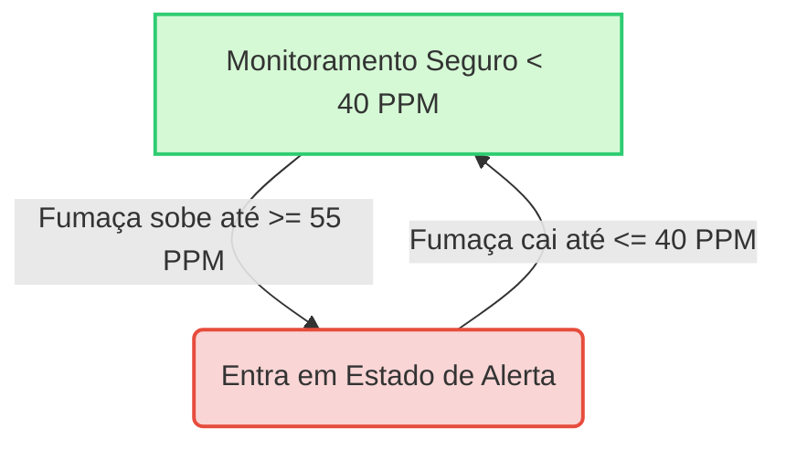

# 🛡️ Arcanjos - Sistema IoT de Detecção de Incêndio e Alerta

Este repositório contém a solução completa de **Sistemas Embarcados e IoT** desenvolvida para a **Arcanjos**, com foco em uma solução inteligente, conectada e acessível para **detecção de fumaça, monitoramento em tempo real e alerta automático de incêndio**.

O projeto evoluiu de um protótipo básico no Tinkercad para um ecossistema IoT completo, contendo suporte a múltiplos microcontroladores (Arduino Uno e ESP32), uma ponte de comunicação serial, um emulador de hardware interativo e uma plataforma web responsiva com dashboard desktop e aplicativo mobile.

---

## 👥 Equipe de Desenvolvimento
- **Diego Ximenes**
- **Luiz Eduardo**

---

## 📂 Estrutura do Projeto

O repositório está organizado da seguinte forma:

```text
N2/
├── Projeto_IoT/
│   ├── Circuito.png                 # Esquema elétrico do circuito físico
│   ├── dispositivo_iot/             # Código dos dispositivos e simuladores
│   │   ├── arduino_serial/          # Firmware para Arduino Uno
│   │   │   └── arduino_serial.ino   # Código C++ com saída JSON via Serial
│   │   ├── esp32_sensor/            # Firmware para ESP32
│   │   │   └── esp32_sensor.ino     # Código C++ com envio via HTTP/WiFi
│   │   ├── emulator.py              # Emulador interativo do sensor em Python (sem hardware)
│   │   └── serial_bridge.py         # Ponte que lê dados da Serial e envia via HTTP
│   └── plataforma_iot/              # Servidor Web e Painéis de Controle (Node.js)
│       ├── server.js                # Servidor Express com Socket.io e Notificações
│       ├── package.json             # Dependências e scripts da plataforma
│       └── public/                  # Interface Web da plataforma
│           ├── index.html           # Dashboard Desktop
│           ├── style.css            # Estilização do dashboard (Glassmorphism)
│           ├── app.js               # Lógica de comunicação em tempo real
│           └── mobile/              # Web App para Dispositivos Móveis
│               ├── index.html       # Interface do App Mobile
│               ├── style.css        # Estilização Mobile
│               └── app.js           # Lógica do App Mobile
└── README.md                        # Documentação oficial do projeto (este arquivo)
```

---

## 🛠️ Tecnologias e Componentes

### 🔌 Componentes do Hardware Físico:
- **Microcontroladores:** Arduino Uno R3 ou ESP32 (do tipo NodeMCU).
- **Sensor de Gás/Fumaça:** Sensor analógico (MQ-2 ou similar).
- **Indicadores Visuais:** LED Verde (Seguro) e LED Vermelho (Alerta).
- **Indicador Sonoro:** Buzzer piezoelétrico (Sirene de alerta).
- **Display:** Display LCD 16x2 com driver comum (RS, E, D4-D7).

### 💻 Stack de Software:
- **Firmwares:** C++ (Arduino IDE).
- **Ponte e Emulação:** Python 3 (com bibliotecas `pyserial` e `requests`).
- **Servidor Backend:** Node.js, Express, Socket.io (WebSocket), Nodemailer (E-mail) e Twilio (SMS).
- **Frontend:** HTML5, CSS3 (design moderno com Glassmorphism), JavaScript (Vanilla) e Chart.js (gráficos em tempo real).

---

## 🔧 Montagem do Circuito (Físico ou Tinkercad)

Abaixo estão as ligações principais recomendadas para montar o protótipo:

### 📌 Pinagem de Conexão (Base Arduino Uno)
*   **Sensor de Gás/Fumaça:** Saída analógica conectada na porta **A5** do Arduino.
*   **LED Verde (Normal):** Conectado ao pino digital **7**.
*   **LED Vermelho (Alerta):** Conectado ao pino digital **6**.
*   **Buzzer (Sirene):** Conectado ao pino digital **5**.
*   **Display LCD 16x2:**
    *   `RS` ➔ Pino **13**
    *   `E` ➔ Pino **12**
    *   `D4` ➔ Pino **11**
    *   `D5` ➔ Pino **10**
    *   `D6` ➔ Pino **9**
    *   `D7` ➔ Pino **8**

> [!NOTE]
> Você pode consultar o arquivo esquemático visual do circuito em [Projeto_IoT/Circuito.png](file:///c:/Users/diego/OneDrive/Documentos/Faculdade/Professor%20Claudio/N2/Projeto_IoT/Circuito.png).

---

## 📋 Como Executar e Testar o Projeto

Siga o passo a passo abaixo para colocar a plataforma e os sensores para rodar.

### 1️⃣ Inicializando a Plataforma Web (Servidor Node.js)
Antes de ligar os dispositivos, precisamos subir o servidor local que receberá os dados.

1. Abra um terminal na pasta da plataforma:
   ```bash
   cd "Projeto_IoT/plataforma_iot"
   ```
2. Instale as dependências necessárias:
   ```bash
   npm install
   ```
3. Inicialize o servidor em modo de desenvolvimento (atualiza automaticamente ao alterar arquivos):
   ```bash
   npm run dev
   ```
4. O terminal exibirá logs confirmando que o servidor está rodando:
   *   **Dashboard Desktop:** `http://localhost:3000`
   *   **App Mobile:** `http://localhost:3000/mobile`
   *   **API Endpoint:** `http://localhost:3000/api/device/data`

> [!TIP]
> Ao iniciar, o servidor cria automaticamente uma conta de e-mail de teste no serviço **Ethereal**. O link de visualização dos e-mails disparados será impresso no terminal sempre que um alerta for enviado, e também aparecerá diretamente no painel do Dashboard.

---

### 2️⃣ Escolha uma das Formas de Simulação/Uso

Você pode testar a plataforma utilizando qualquer uma das três opções abaixo:

#### 🔹 Opção A: Emulador Interativo em Python (Recomendado para Testes Sem Hardware)
Se você não possui os componentes físicos ou não quer ligar as placas agora, utilize o emulador em Python. Ele simula o comportamento dos sensores com controles interativos de teclado.

1. Certifique-se de ter o Python instalado e abra um terminal na pasta de dispositivos:
   ```bash
   cd "Projeto_IoT/dispositivo_iot"
   ```
2. Instale a biblioteca `requests`:
   ```bash
   pip install requests
   ```
3. Execute o emulador:
   ```bash
   python emulator.py
   ```
4. **Controles interativos do terminal:**
   *   Pressione a tecla `A` para simular um **Alerta de Incêndio** (o nível de fumaça sobe gradualmente acima de 55 PPM).
   *   Pressione a tecla `S` para simular o **Retorno ao Seguro** (o nível de fumaça cai gradualmente abaixo de 40 PPM).
   *   Pressione a tecla `Q` para sair do emulador.

---

#### 🔹 Opção B: Circuito Físico do Arduino Uno + Ponte Serial
Se você montou o circuito no Arduino Uno físico:

1. Grave o arquivo [arduino_serial.ino](file:///c:/Users/diego/OneDrive/Documentos/Faculdade/Professor%20Claudio/N2/Projeto_IoT/dispositivo_iot/arduino_serial/arduino_serial.ino) na sua placa utilizando a Arduino IDE.
2. Mantenha o Arduino conectado na porta USB do computador.
3. Abra um terminal na pasta de dispositivos:
   ```bash
   cd "Projeto_IoT/dispositivo_iot"
   ```
4. Instale as dependências da ponte:
   ```bash
   pip install pyserial requests
   ```
5. Execute o script da ponte serial:
   ```bash
   python serial_bridge.py
   ```
6. O script listará as portas COM disponíveis. Selecione o número correspondente à porta do seu Arduino. Ele começará a capturar as leituras via serial (em formato JSON) e a repassar automaticamente para a API da plataforma.

---

#### 🔹 Opção C: Dispositivo ESP32 Autónomo (WiFi)
Se você está utilizando um ESP32:

1. Abra o arquivo [esp32_sensor.ino](file:///c:/Users/diego/OneDrive/Documentos/Faculdade/Professor%20Claudio/N2/Projeto_IoT/dispositivo_iot/esp32_sensor/esp32_sensor.ino) na Arduino IDE.
2. Altere as variáveis `ssid` e `password` com os dados da sua rede WiFi local.
3. Altere o endereço IP em `serverEndpoint` para o endereço de IP local do seu computador rodando o servidor Express (Ex: `http://192.168.1.15:3000/api/device/data`).
4. Grave o código no ESP32. Ele enviará os dados diretamente via WiFi sem necessidade do script Python rodando no computador.

---

## 🧠 Lógica de Controle do Alerta (Histerese)

Para evitar disparos falsos e oscilações constantes no buzzer/LEDs quando o valor do sensor de fumaça flutua próximo ao limite, o sistema implementa a lógica de **Histerese**:



*   **Ativação do Alerta:** O sistema só entra em estado de emergência quando o nível de fumaça atinge ou ultrapassa **55 PPM**.
*   **Desativação do Alerta (Retorno ao normal):** O alarme só cessa e o sistema volta para o modo "ambiente seguro" quando a fumaça dissipa e atinge valores iguais ou inferiores a **40 PPM**.

---

## 🔔 Testando as Notificações de Emergência

Quando o sistema detecta uma emergência (fumaça >= 55 PPM), a plataforma realiza ações simultâneas para alertar os responsáveis:

### 1. E-mail de Emergência (Real ou Simulado)
*   **Simulado (Padrão):** O servidor gera uma conta SMTP fictícia no Ethereal. No console do servidor, aparecerá um link como `https://ethereal.email/message/...`. Você pode clicar nesse link para ver a renderização do e-mail com layout de emergência vermelho da Arcanjos.
*   **Real:** Crie um arquivo `.env` na pasta `plataforma_iot` e configure as credenciais SMTP de um e-mail de envio real (ex: Gmail, Outlook).

### 2. SMS no Smartphone Virtual do Dashboard
*   Se você não configurou credenciais reais da API do Twilio, a plataforma simula a recepção de SMS.
*   Ao disparar o alerta, uma animação de smartphone subirá no canto inferior direito do Dashboard Desktop em tempo real, mostrando o recebimento do SMS simulado com a mensagem de emergência.

### 3. Sirene Sonora Dinâmica no Navegador
*   O dashboard e a versão mobile utilizam a **Web Audio API** do navegador. Quando o sistema entra em alerta, o seu navegador emitirá de forma sintetizada um alarme sonoro de sirene, acompanhado de um piscar vermelho em toda a tela.
